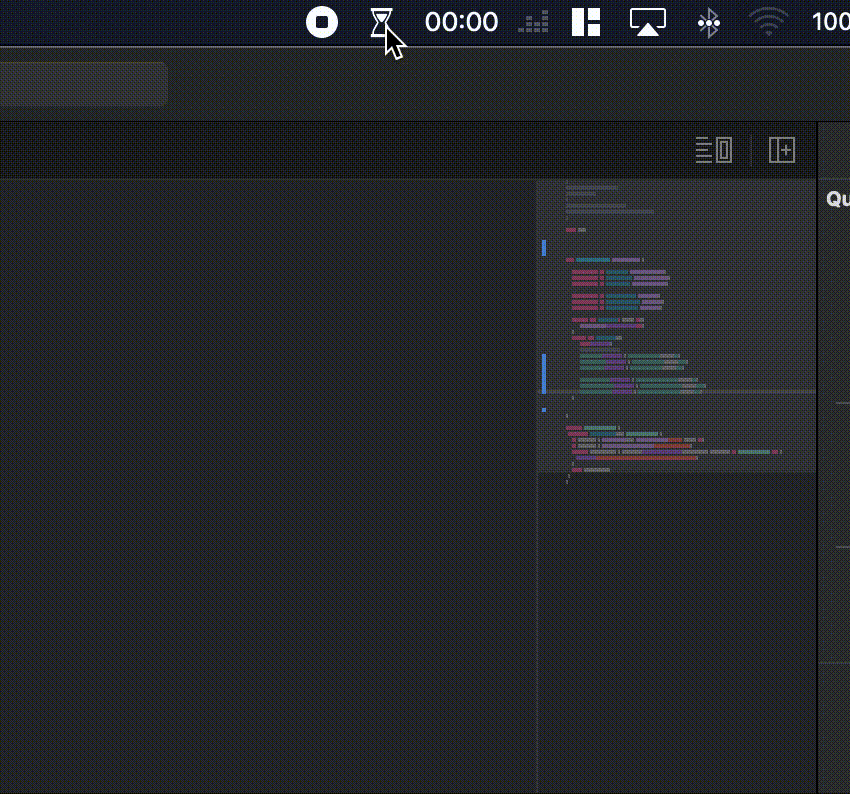

## Year Progress

A simple Mac OSX status bar application made for fun and practice.

Basicaly it shows how much of the Day,Month and Year has passed.

## Running as Dev

Just open **year-progress.xcodeproj** and press run.

## Running as User

Open **year-progress.app** on releases folder.
